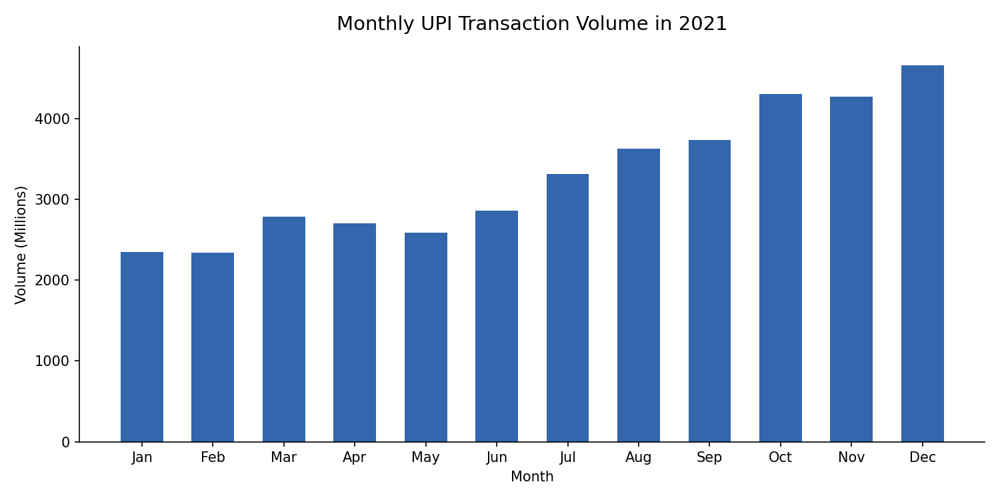
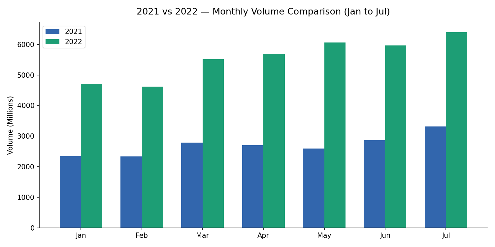
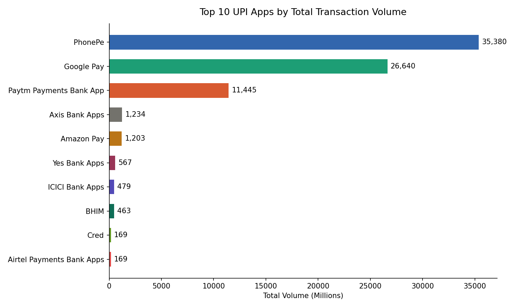
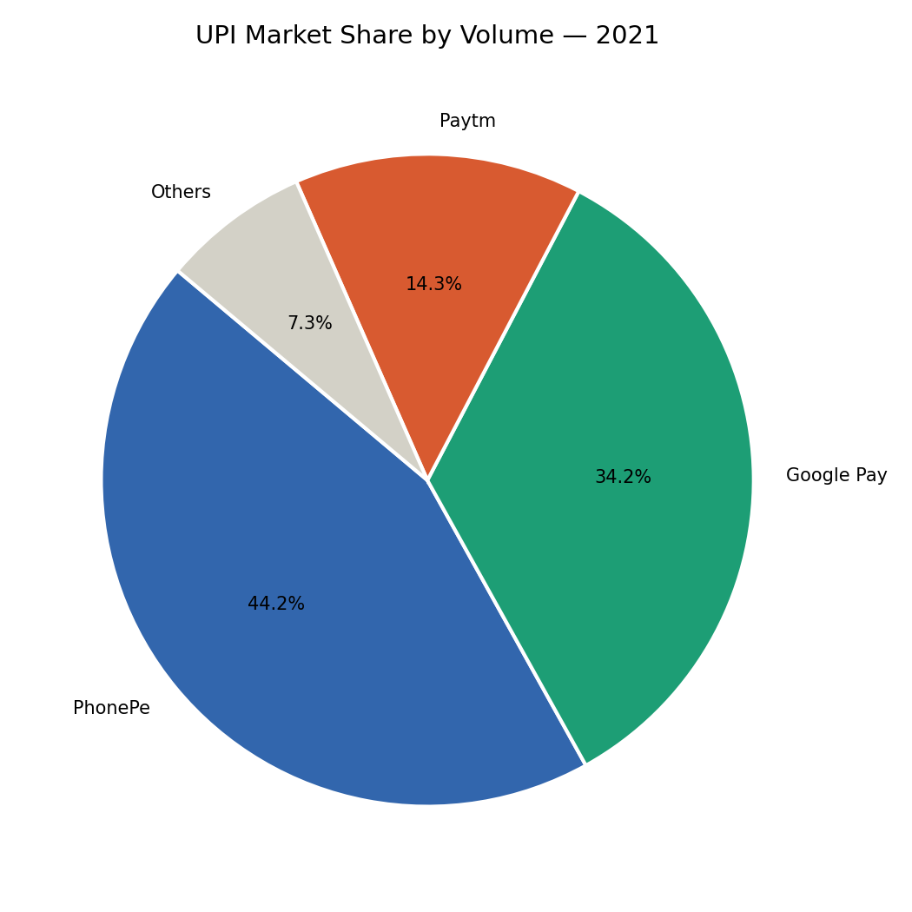
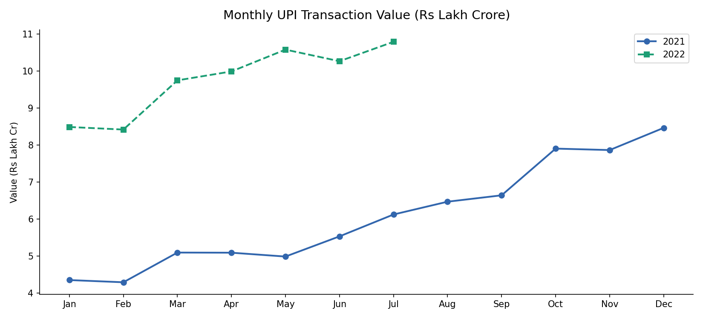

#  UPI Transaction Analysis 

**Analyzing India's digital payments growth using real NPCI data (2021–2022)**

---

##  About This Project

This is my data analysis project made during the **Digital India Internship**. I used real UPI (Unified Payments Interface) data from NPCI (National Payments Corporation of India) to study how digital payments in India grew between 2021 and 2022.

I used **Python** to clean the data and create charts, and **Power BI** to build an interactive dashboard.

---

## 📸 Charts

### Monthly Volume — 2021


### 2021 vs 2022 Comparison


### Top 10 UPI Apps


### Market Share — 2021


### Monthly Value Trend


---

##  What I Found (Key Insights)

1. **UPI grew 68.8% year-over-year** — Average monthly transactions jumped from 3,295 Mn (2021) to 5,561 Mn (2022)
2. **PhonePe is the clear leader** — 35,380 Mn total volume, which is 1.5× more than Google Pay
3. **Market is dominated by 3 apps** — PhonePe, Google Pay, and Paytm make up the vast majority of all UPI transactions, even though 121 apps are active
4. **No slowdown in January 2022** — Volume in Jan 2022 (4,708 Mn) was already higher than Dec 2021 (4,658 Mn), showing UPI became a daily habit
5. **Transaction value more than doubled** — From ₹4.35 Lakh Cr (Jan 2021) to ₹10.79 Lakh Cr (Jul 2022)
6. **Steady growth every quarter in 2021** — Volume nearly doubled from Q1 to Q4

---

## Dataset

| File | Rows | Period |
|------|------|--------|
| `data/upi_2021.csv` | 654 | January – December 2021 |
| `data/upi_2022.csv` | 452 | January – July 2022 |

**Source:** National Payments Corporation of India (NPCI) — publicly available data

**Columns in the data:**
- `UPI Banks` — Name of the app or bank
- `Volume (Mn)` — Number of transactions (in Millions)
- `Value (Cr)` — Money transferred (in Crores ₹)
- `Month` — Month number (1 = January, 12 = December)
- `Year` — 2021 or 2022

---

##  Tools Used

| Tool | What I used it for |
|------|-------------------|
| Python (pandas) | Loading and cleaning the data |
| Python (matplotlib) | Creating charts |
| Power BI | Making an interactive dashboard |
| GitHub | Sharing the project |

---

## Project Files

```
upi-transaction-analysis/
│
├── data/
│   ├── upi_2021.csv          ← Raw dataset (2021)
│   └── upi_2022.csv          ← Raw dataset (2022)
│
├── outputs/
│   ├── chart1_volume_2021.png
│   ├── chart2_volume_2022.png
│   ├── chart3_comparison.png
│   ├── chart4_top10_apps.png
│   ├── chart5_market_share.png
│   ├── chart6_value_trend.png
│   └── summary.csv           ← Key numbers in one file
│
├── analysis.py               ← Main Python script (well commented)
├── key_insights.md           ← My written analysis
├── requirements.txt          ← Python libraries needed
└── README.md                 ← This file
```

---

##  How to Run This Project

### Step 1 — Install Python
Download from [python.org](https://python.org) if you don't have it.

### Step 2 — Install the required libraries
Open your terminal/command prompt and type:
```
pip install -r requirements.txt
```

### Step 3 — Run the analysis
```
python analysis.py
```

That's it! All 6 charts will be saved in the `outputs/` folder automatically.

---

##  What I Learned

- How to load and clean messy real-world data using pandas
- How to fix common problems like extra spaces in column names and comma-formatted numbers
- How to create professional charts using matplotlib
- How to build an interactive dashboard in Power BI
- How to present data analysis findings clearly

---

##  Author

**Pratibha Singh**  
  
Netaji Subhas University of Technology, New Delhi

[](https://linkedin.com/in/pratibha-singh-25b040250)
[](https://github.com/Pratibha-analytics)

---

*Data source: NPCI (npci.org.in) — publicly available UPI transaction statistics.*
